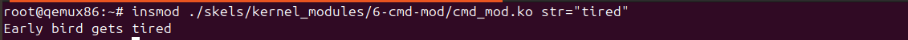

[Exercice 1](https://linux-kernel-labs.github.io/refs/heads/master/labs/kernel_modules.html#kernel-module)

1.Command to load module insmod 

2.Command to unloead module rmmod  


[Exercice 2 : printk ](https://linux-kernel-labs.github.io/refs/heads/master/labs/kernel_modules.html#printk)

Since the code in the module is using pr_debug() so the log level is 7 , to disable message outputs on the console we just have to set the printk current log level using echo 7 > /proc/sys/kernel/printk 


We can only see the debug message running the command dmesg after setting the console log level to 7 . 


[Exercice 4 : Submodules](https://linux-kernel-labs.github.io/refs/heads/master/labs/kernel_modules.html#sub-modules)

Just had to made these changes in the [Kbuild](./exercises/ex04/Kbuild) file under #todo comment


[Exerice 5 : Kernel oops](https://linux-kernel-labs.github.io/refs/heads/master/labs/kernel_modules.html#kernel-oops-1)

Enable the -g flag for debugging in [Kbuild](./exercices/ex5/Kbuild) 

Null pointer dereference happens in adress EIP = 


Using the 0x0d offset in the EIP adress we can find the exact line  using ```objdump -dS oops_mod.ko  ```objdump -dS oops_mod.ko  


 

Same method but with addr2line to get the line in the source files . 


[Exerice 6 : Module parameters](https://linux-kernel-labs.github.io/refs/heads/master/labs/kernel_modules.html#module-parameters)

Just passing the str variable as an argument as in the following image is enough . 



[Exerice 7 : Proc info](https://linux-kernel-labs.github.io/refs/heads/master/labs/kernel_modules.html#proc-info-1)

The difficult part was finding current macro which is ``#define current get_current()`` and ``static __always_inline struct task_struct *get_current(void)``
The code of the module can be found in [list_proc.c](./exercises/ex7/list_proc.c)

